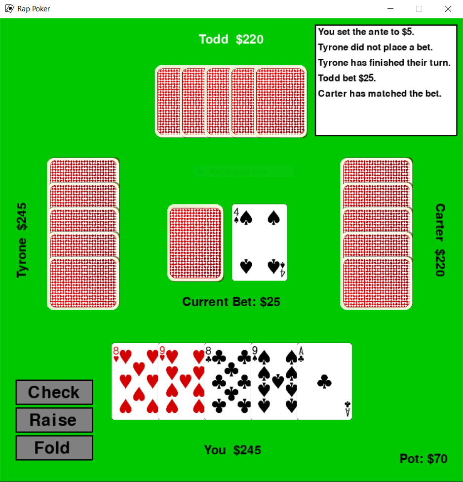

# Rap Poker
A single-player variation of poker. Each player starts with five cards and has the opportunity to replace one card every turn. 
They can draw from either the draw pile or discard pile. Play continues until one player is satisfied with their hand and raps on the table.
Then, all the other players get one more turn before a final betting round.

# Installation:
Note: requires Python version 3.8 and pygame version 2.0
`pip install pygame`

# Playing:
`python menu.py`

# Demo:

  

